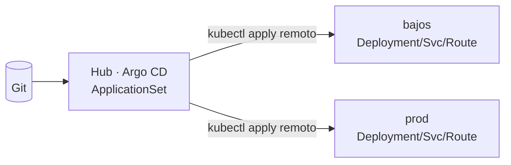
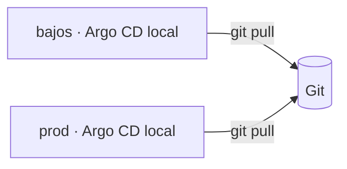
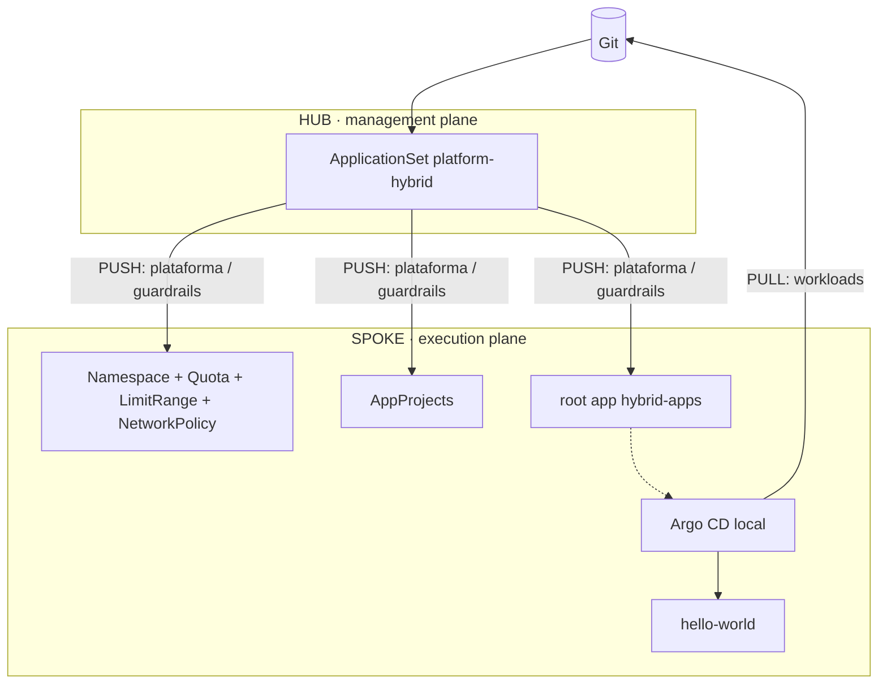

# Argo CD Multicluster: Push vs Pull (vs Hybrid)

Demo de la charla **"Argo CD Multicluster: Push vs Pull strategies for Scaling Your Infrastructure"**
(KCD Perú / KCD Buenos Aires 2026) — Pablo Castelo & Rodrigo Alvarez.

La **misma app** (`manifests/hello-world`) se despliega con los 3 modelos en los mismos clusters.
La página muestra el modelo (color) y el entorno, así se ve en vivo quién desplegó qué.

👉 **Guion paso a paso de la demo: [demo/DEMO.md](demo/DEMO.md)** (scripts `reset.sh`, `status.sh`, `refresh.sh`).

| Modelo | Quién aplica los workloads | Credenciales de los spokes | Si el hub se cae… |
|---|---|---|---|
| **PUSH** 🟧 | Argo CD del **hub**, contra la API remota | En el hub | Nadie sincroniza |
| **PULL** 🟩 | Argo CD **local** de cada spoke | Nunca salen del spoke | Todo sigue, pero no hay vista central ni gobierno |
| **HYBRID** 🟪 | Argo CD **local** (workloads) + **hub** (plataforma) | En el hub, sólo para la capa de plataforma | Las apps siguen sincronizando; se congela la plataforma |

```
.
├── manifests/hello-world/      # la app, 100% Kustomize
│   ├── base/                   #   una sola base para los 3 modelos
│   ├── envs/{bajos,prod}/      #   lo que cambia por ENTORNO (réplicas, texto)
│   ├── components/{push,pull,hybrid}/  # lo que cambia por MODELO (Kustomize Components)
│   └── deploy/<modelo>/<env>/  #   entorno + modelo + namespace  → lo que apunta Argo CD
├── push/                       # hub-only
├── pull/                       # spoke-only
└── hybrid/                     # hub = management plane, spokes = execution plane
```

Clusters: `bajos` (dev) y `prod` como spokes, más un **hub** con OpenShift GitOps
para push e hybrid. Los spokes deben estar registrados en el hub con esos nombres
(`argocd cluster add` o Secret `argocd.argoproj.io/secret-type: cluster`).

---

## Kustomize: dónde aplica

```bash
oc kustomize manifests/hello-world/deploy/hybrid/prod   # ver lo que va a aplicar Argo CD
```

- **base + overlays** — `envs/prod` sube réplicas a 2 y cambia `MI_ENTORNO`.
- **Components** — `components/<modelo>` es un "plugin" que se enchufa a cualquier entorno
  (agrega label `kcd.demo/model` y el color). Sin componentes serían 6 overlays copy-paste.
- **configMapGenerator** — el HTML y la config se generan con hash en el nombre:
  cambiar un valor en Git ⇒ nombre nuevo ⇒ **rollout automático** del Deployment.
- **Bootstrap por cluster** — `pull/bootstrap/{bajos,prod}` parchea la root app (JSON6902).
- **Plataforma por entorno** — `hybrid/platform/overlays/<env>` cambia la cuota de cada entorno.

---

## 1. PUSH — "Centralism"



El ApplicationSet del hub genera una Application por cluster (`push/clusters/*/cluster-config.json`)
con `destination.name: <cluster>`. **El spoke no necesita Argo CD.**

```bash
# en el HUB
oc apply -k push/bootstrap
```

Demo:
1. Ver en el hub `hello-world-push-bajos` / `-prod`: el árbol muestra los Pods de **otros** clusters.
2. Cambiar réplicas en `manifests/hello-world/envs/prod` → commit → el hub las empuja.
3. "Agregar un cluster" = copiar `push/clusters/prod` → `push/clusters/<nuevo>` y commitear.
4. Escalar a 0 el controller del hub → ningún cluster recibe cambios (single point of failure).

## 2. PULL — "Federalism"



Cada spoke se bootstrapea solo y se sincroniza con `https://kubernetes.default.svc`.
El hub no existe para este modelo.

```bash
# logueado en cada spoke
oc apply -k pull/bootstrap/bajos     # en bajos
oc apply -k pull/bootstrap/prod      # en prod
```

Demo:
1. Mostrar que no hay ningún Secret de cluster: las credenciales no salen del spoke (zero trust).
2. Commit → cada spoke lo toma por su cuenta.
3. Contra: para saber el estado de 50 clusters hay que entrar a 50 consolas (la "Rogue Province").

## 3. HYBRID — Management plane vs Execution plane



Separación de responsabilidades, **forzada por AppProjects** (no por convención):

| | Hub (`hybrid-platform`) | Spoke (`hello-world-hybrid`) |
|---|---|---|
| Namespace, ResourceQuota, LimitRange, NetworkPolicy | ✅ | ❌ blacklist |
| AppProjects + root app del spoke | ✅ | ❌ |
| Deployment / Service / Route | ❌ no está en la whitelist | ✅ |

```bash
# en el HUB
oc apply -k hybrid/bootstrap
# nada que aplicar en los spokes: el hub les instala la root app (requiere OpenShift GitOps instalado)
```

Demo (la que más vende):
1. **Day-0 push**: en el hub aparece `platform-bajos` / `platform-prod`; en cada spoke aparece
   `hybrid-apps` → `hello-world-hybrid` (lo creó el hub, lo ejecuta el spoke).
2. **El hub se cae, las apps no**:
   ```bash
   # HUB
   oc -n openshift-gitops scale statefulset openshift-gitops-application-controller --replicas=0
   ```
   Cambiar `MI_ENTORNO` en `manifests/hello-world/envs/bajos` → commit → la página de bajos
   cambia igual (rollout por el hash del ConfigMap). Volver a escalar a 1.
3. **Gobierno central**: en un spoke `oc -n kcd-hybrid-prod delete resourcequota team-quota`
   → el hub la repone (selfHeal).
4. **Guardrails**: subir réplicas de bajos a 10 en `envs/bajos` → la cuota (`pods: 4`) frena el
   rollout. El equipo no puede subir la cuota: su AppProject la tiene en blacklist.
5. **Escalar**: `hybrid/clusters/<nuevo>/` + overlay en `hybrid/platform/overlays/<nuevo>` → commit.

Opcional: para ver en el hub el health de la root app del spoke, agregar al CR `ArgoCD` del hub:

```yaml
spec:
  resourceHealthChecks:
  - group: argoproj.io
    kind: Application
    check: |
      hs = {status = "Progressing", message = ""}
      if obj.status ~= nil and obj.status.health ~= nil then
        hs.status = obj.status.health.status
        if obj.status.health.message ~= nil then hs.message = obj.status.health.message end
      end
      return hs
```

> **Con ACM/OCM**: OpenShift trae este mismo patrón "productizado" (Argo CD pull model de ACM:
> ApplicationSet en el hub + `ManifestWork` + reporte de estado al hub). Este repo lo hace con
> Argo CD vanilla para que sirva en cualquier Kubernetes.

---

## Convivencia con el layout anterior

Este layout usa nombres propios (namespaces `kcd-<modelo>-<cluster>`, Applications y AppProjects
nuevos), así que puede convivir con lo desplegado por el layout anterior (`*-example-*`).
Para limpiar lo viejo: borrar las root apps (`applications-push`, `applications-pull`,
`applications-hybrid` y las `openshift-gitops-*-app-*`) y después los namespaces `*-example-*`
(tienen `prune: false`, no se van solos).

Bugs que tenía el layout anterior (los corrige este):
- `overlays/bajos/push` usaba `namespace: dev-example-pull` → el demo push caía en el namespace de pull.
- `overlays/prod/{push,pull}` parcheaban `name: hello-world` (no existe) → el patch no se aplicaba y no había `MI_ENTORNO`.
- `overlays/prod/hybrid` decía "Desarrollo".
- Typo `argocd.argopj.io/sync-wave` → la anotación se ignoraba.
- El "push" en realidad creaba Applications **dentro** del spoke (el Argo local hacía el deploy), o sea ya era híbrido.
- El hybrid de `prod` terminaba también en `bajos` (Application `prod-hello-world-app-hybrid` y namespace `prod-example-hybrid` en el cluster de dev).
